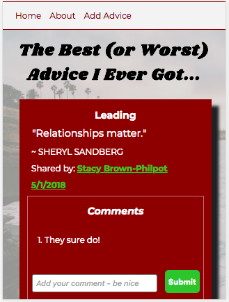
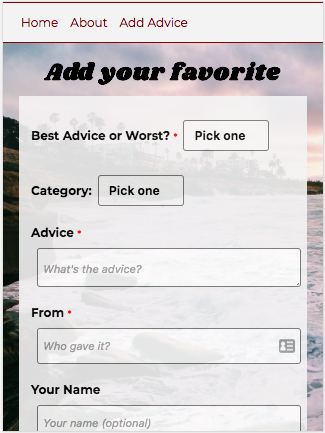
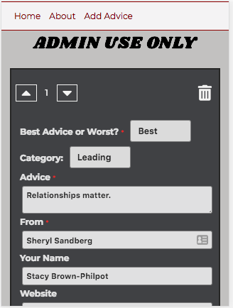
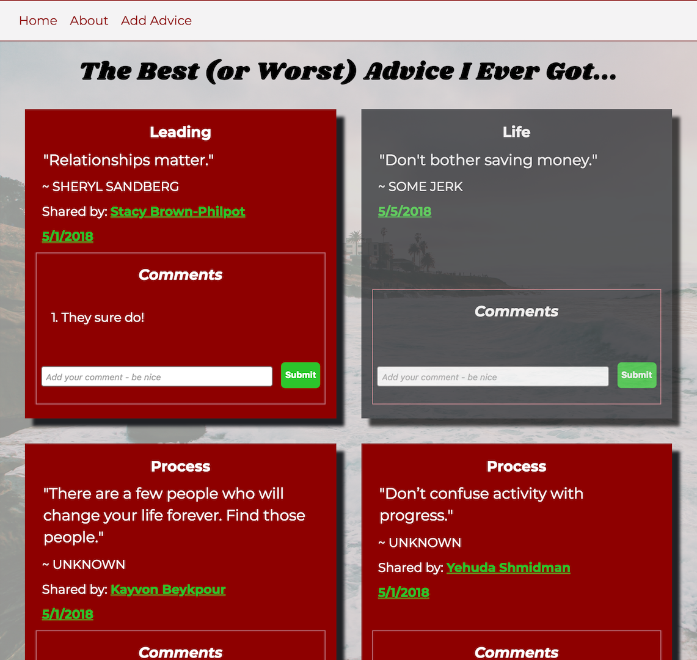
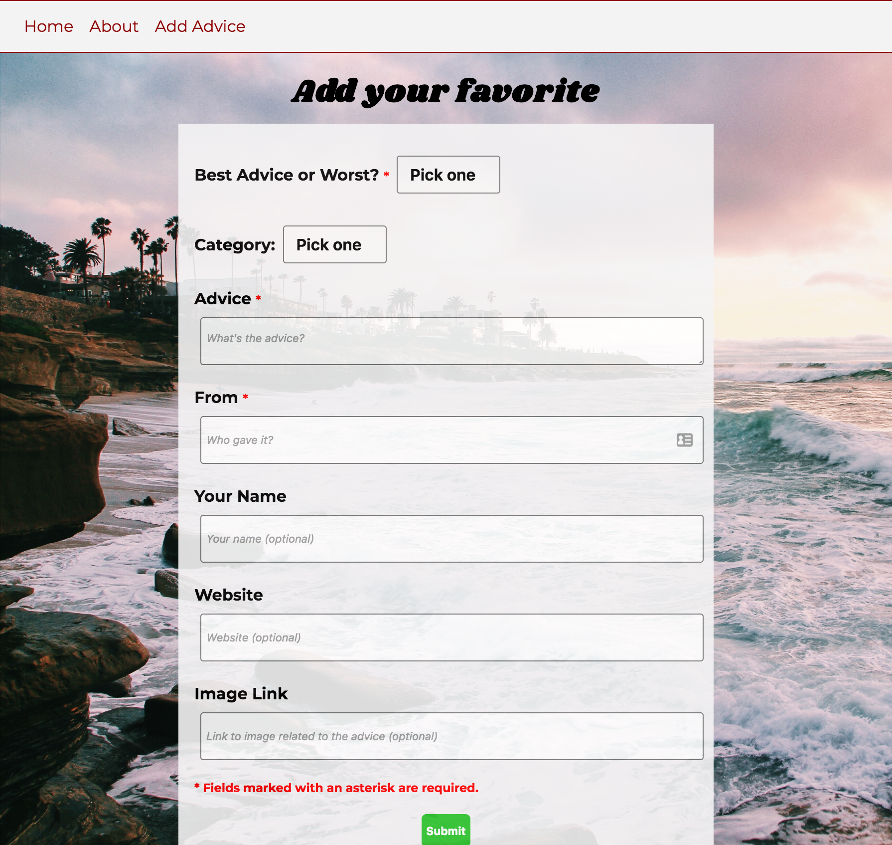
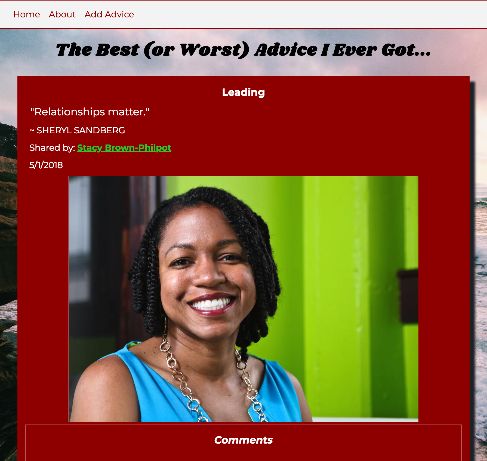
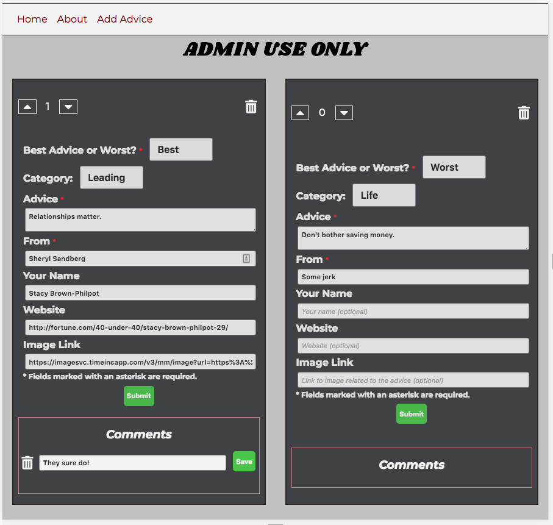

Best or Worst Advice
====================
By Jennifer Evenson

Objective
=========
Create a site where visitors can post the best or worst advice they've ever gotten and who gave it to them. Users can also read and comment on entries from other users. The administrator can edit and delete entries and comments.

Functionality
=============
* Mobile first design. Laid out with CSS Grid so that it's automatically responsive without media breaks. There's one media break at 620px to increase the font size on "html" and increase the whitespace around the About and Add Advice content sections. Each section sets the font size to 1 rem so font sizes scale automatically and expectedly.

* Site users can add the best or worst advice they've ever gotten on a form and submit it. 
    * There are seven fields available, but only three are required (best/worst, the advice, and who gave the advice). All seven fields are: 
        * Best or Worst (required)
        * Category (optional, defaults to "Life")
        * Advice (required)
        * From - who gave the advice (required)
        * Your name - site user who is sharing the advice (optional)
        * Website URL (optional)
        * Image Link (optional)
    * If the user fills out the optional "your name" field, the advice block will show "Shared by: \<name\>". 
    * If the user also fills out the optional "website" field, the advice block will show "Shared by: [\<name\>](http://www.github.com) " and the name will be a link to the website. 
    * If only a website is shared, without a name, the advice block will show "Shared by: [Anonymous](http://www.github.com)" and Anonymous will be a link to the website.

* Users can comment on advice entries.
* Administrator can delete advice, delete comments, and edit comments. Can also re-order the advice with the "upvote / downvote" module. 

* The opacity of the background image of the page is conditionally rendered based on which "Router" link is loaded. The homepage has a lighter background image, while the About and Add pages display the image normally. 
* The background color of the advice block renders conditionally based on whether the advice is the "best" (red background) or the "worst" (gray background).
* The date the advice was added to the website becomes a "permalink" to display that advice on its own page, for bookmarking or sharing. (Using a Router URL parameter and doing a "get one" from the database.)
    * The individual advice page shows the photo at the URL that was optionally entered by the user. If no URL was entered, that html element isn't rendered on the page.
* Displaying the list of advice blocks on the home page uses a two level sort - first by most votes and then in reverse date order (newest first). (At this time, only the administrator can see how many "votes" each entry has since only the administrator can change that.)

Technologies Used
=================
* Front End: HTML5, CSS3, JavaScript, React, React Router, Redux + Thunk, Axios
* Back End: Express, MongoDB, Mongoose
* Hosted at Heroku with the database at MLab

Challenges / Lessons Learned
============================
* There is one Form component that handles both adding and editing versus having one component for each, as I had been taught.
* I wanted to keep all the data I'd loaded into my local Mongo database, so I spent some time learning how to export and import JSON files into Mongo.

Mobile Views
============

| Main Mobile View | Add Advice | Individual Advice | Admin Page| 
| :---: | :---: | :---: | :---: |
|  |  |  |  |

Desktop Views
=============
## Home page

## Add Advice

## Individual Advice

## Admin Page

Ideas for Improvements
======================
* User authentication so users can edit / delete their own entries and edit / delete their comments. Would also allow users to upvote and downvote other entries, and save favorites. 
* Allow users to search, sort, and filter the displayed advice by author, date, category. 
* Allow users to "flag as inappropriate" - advice and comments.
* Allow users to add new categories of advice, or at least suggest new categories. 
* Include the photo on the home page (list of advice) rather than just on the individual advice page.

Inspiration for the Project
===========================
This was an [assignment](assignment.md) for a class. 
